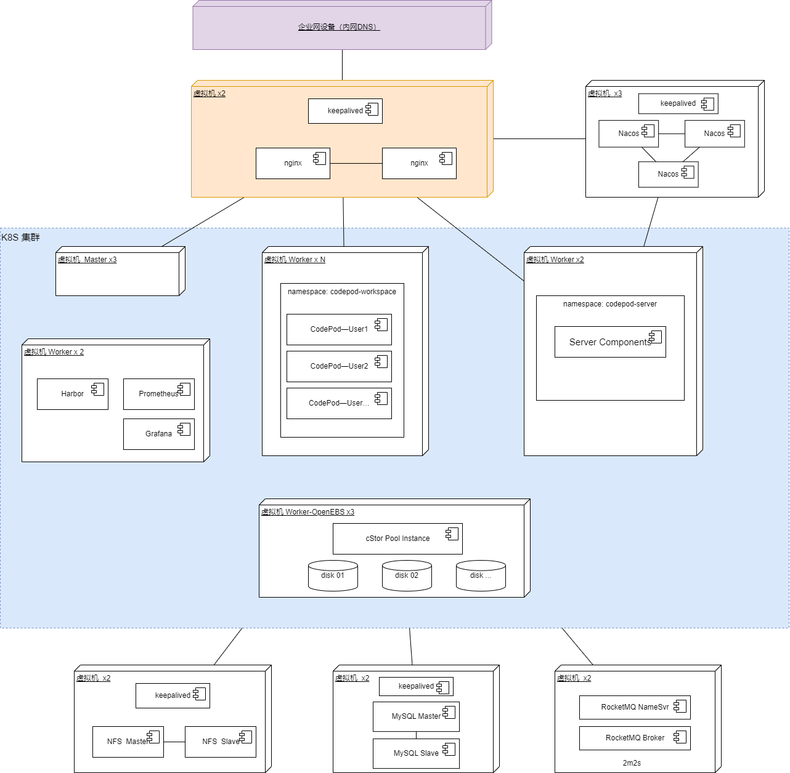

# 架构设计

## 系统上下文

## 概念架构

概念架构视图

## 逻辑架构

逻辑架构视图

## 物理架构

### 物理架构视图

### 部署架构视图

部署架构视图

#### 测试开发环境

**部署服务器清单**

| 服务器名称 | 类型       | CPU | 内存（G） | 磁盘(G) | 公网带宽(Mbps) | 内网带宽(Gps) | 数量 | 部署内容       |
| :--------- | :--------- | :-- | :-------- | :------ | :------------: | :-----------: | :--- | :------------- |
| 云服务器   | 轻量服务器 | 2   | 2         | 50      |       2        |       1       | 1    | nginx、公网 IP |
| 云服务器   | 云主机     | 4   | 32        | 100     |       2        |       1       | 1    | 服务运行组件   |

#### 上云环境

**部署服务器清单**

| 服务器名称 | 类型         | CPU | 内存（G） | 磁盘(G) | 公网带宽(Mbps) | 带宽(Gps) | 数量 | 部署内容           |
| :--------- | :----------- | :-- | :-------- | :------ | :------------: | :-------: | :--- | :----------------- |
| SLB        | 负载均衡器   |     |           |         |       10       |           | 1    | 公网 IP            |
| 云服务器   | 云主机       | 2   | 4         | 100     |                |     1     | 2    | nginx              |
| k8s-master | k8s 集群     |     |           |         |                |           | 3    | 云托管             |
| k8s-worker | 云主机       | 4   | 16        | 100     |       2        |     1     | 2    | workspace 服务组件 |
| k8s-worker | 云主机       | 4   | 32        | 100     |       2        |     1     | 2..N | code pod           |
| k8s-worker | 云主机       | 2   | 4         | 200     |       2        |     1     | 3..N | OpenEBS cStor Pool |
| MySQL      | 云数据库     | 2   | 4         | 100     |                |           | 1    |                    |
| Nacos      | 微服务引擎   | 1   | 2         |         |                |           | 1    |                    |
| RocketMQ   | 消息队列     |     |           |         |                |           | 1    |                    |
| 镜像仓库   | 容器镜像仓库 |     |           |         |                |           | 1    |                    |

#### 企业私有化环境

**部署服务器清单**

| 服务器名称        | 类型   | CPU | 内存（G） | 磁盘(G) | 公网带宽(Mbps) | 带宽(Gps) | 数量 | 部署内容              |
| :---------------- | :----- | :-- | :-------- | :------ | :------------: | :-------: | :--- | :-------------------- |
| 内网 DNS          | DNS    |     |           |         |                |           | 1    |                       |
| 服务器            | 虚拟机 | 2   | 4         | 100     |                |     1     | 2    | nginx                 |
| 服务器 k8s-master | 虚拟机 | 2   | 8         | 100     |                |     1     | 3    | k8s master            |
| 服务器 k8s-worker | 虚拟机 | 4   | 16        | 100     |                |     1     | 2    | workspace 服务组件    |
| 服务器 k8s-worker | 虚拟机 | 4   | 32        | 100     |                |     1     | 2..N | code pod 用户工作空间 |
| 服务器 k8s-worker | 虚拟机 | 4   | 16        | 100     |                |     1     | 2    | 镜像仓库、监控中心    |
| 服务器 k8s-worker | 虚拟机 | 2   | 8         | 500     |                |     1     | 3..N | OpenEBS cStor Pool    |
| 服务器            | 虚拟机 | 4   | 16        | 100     |                |     1     | 2    | MySQL 数据库          |
| 服务器            | 虚拟机 | 2   | 8         | 100     |                |     1     | 2    | RocketMQ              |
| 服务器            | 虚拟机 | 2   | 8         | 100     |                |     1     | 3    | nacos                 |
| 服务器            | 虚拟机 | 2   | 8         | 100     |                |     1     | 2    | NFS                   |

## 开发架构

### 技术选型

| 分类     | 项目          | 技术选型      | 版本     |
| :------- | :------------ | :------------ | :------- |
| 操作系统 | 所有服务器    | CentOS        | 7.9      |
| 数据库   | 数据库服务器  | MySQL         | 8.0      |
| 中间件   | 消息中间件    | RocketMQ      | 4.9.x    |
| 中间件   | 配置中心      | Nacos         | 2.1.2    |
| 开发语言 | 后端组件      | Java          | 17       |
| 开发组件 | 后端工程      | SpringBoot    | 3.x      |
| 开发组件 | 后端 WEB 框架 | WebFlux       |          |
| 开发组件 | 后端 WEB 框架 | GraphQL       |          |
| 开发组件 | 微服务框架    | SpringCloud   | 2022.0.3 |
| 开发组件 | 数据库访问    | R2DBC         |          |
| 运行平台 | 容器技术      | docker        | 24.x     |
| 运行平台 | 容器技术      | k8s           | 1.22.x   |
| 开发语言 | 前端组件      | Html/JS       |          |
| 开发组件 | 前端工程      | Vue           | 3        |
| 开发组件 | 前端构建      | Vite          | 4        |
| 开发组件 | 前端 UI       | element-plus  |          |
| 开发组件 | 前端 API      | apollo-client |          |
| 开发组件 | 前端 API      | graphql       |          |

### 开发组件一览表

| 模块名           | 逻辑名           | 物理名        | 文件名            | 代码工程名    | 代码工程类型        | 形态     | 开发语言 | 运行环境       |
| :--------------- | :--------------- | :------------ | :---------------- | :------------ | :------------------ | :------- | :------- | :------------- |
| 前端 UI          | 前端 UI          | workspace-ui  | workspace-ui.zip  | workspace-ui  | vue                 | web 前端 | html     | win/linux/容器 |
| API 网关         | API 网关         | gateway       | gateway.jar       | gateway       | springcloud gateway | server   | java     | win/linux/容器 |
| 工作空间服务     | 工作空间服务     | workspace     | workspace.jar     | workspace     | springcloud         | server   | java     | win/linux/容器 |
| 工作空间执行 JOB | 工作空间执行 JOB | workspace-job | workspace-job.jar | workspace-job | springcloud         | server   | java     | win/linux/容器 |
| 数据空间执行 JOB | 数据空间执行 JOB | dataspace-job | dataspace-job.jar | dataspace-job | springcloud         | server   | java     | win/linux/容器 |

## 运行架构

_控制流_

## 数据架构

### 数据分布、格式、技术选型

| 数据名称     | 数据描述                                   | 存储格式 | 存储位置 ｜技术选型 |
| :----------- | :----------------------------------------- | :------- | :------------------ | :----------- |
| 用户数据     | 用户信息、账号、租户、组织、角色、权限等   | 关系数据 | 数据库              | MySQL        |
| 工作空间数据 | 工作空间、空间模板、镜像信息、数据空间信息 | 关系数据 | 数据库              | MySQL        |
| 数据空间存储 | 用户代码、文件存储                         | 文件     | 分布式存储          | OpenEBS、NFS |
| 消息数据     | 微服务、执行 job 调度通信数据              | 消息     | 消息队列            | RocketMQ     |

### 数据隔离技术选型

> 用户数据隔离：结合业务需求、领域模型设计数据库结构，技术选型：MySQL关系表。
> 文件数据隔离：用户工作空间分配的存储是独立的硬盘或者文件夹，用户只能操作容器本身及挂在容器的Volumes，技术选型：k8s PV。

### ER图

**用户数据**

