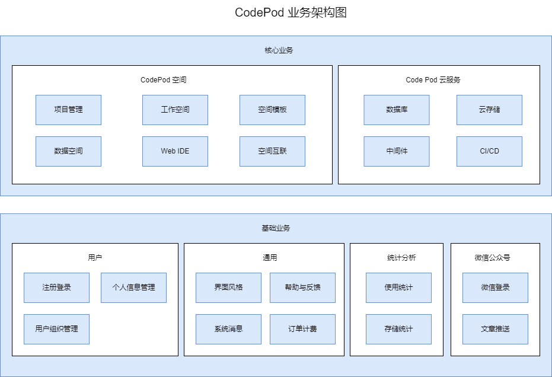
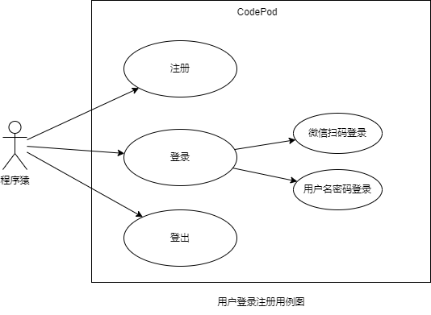
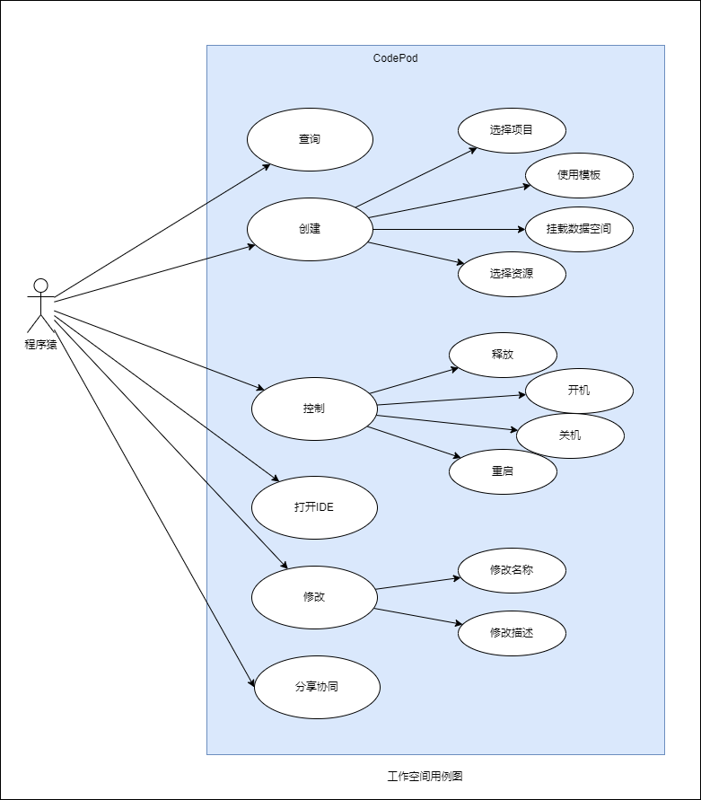
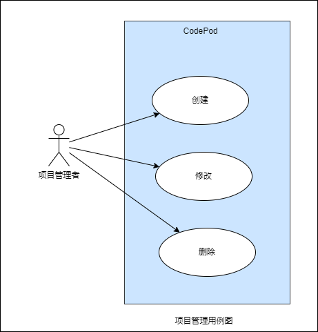
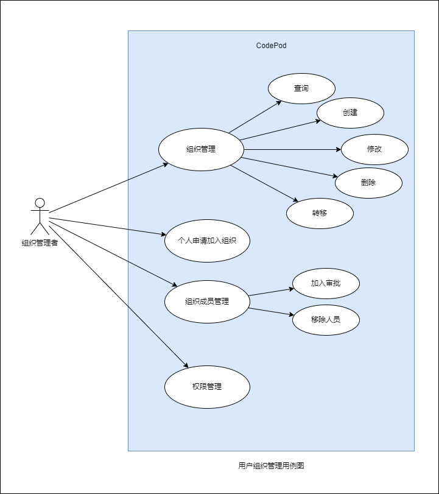
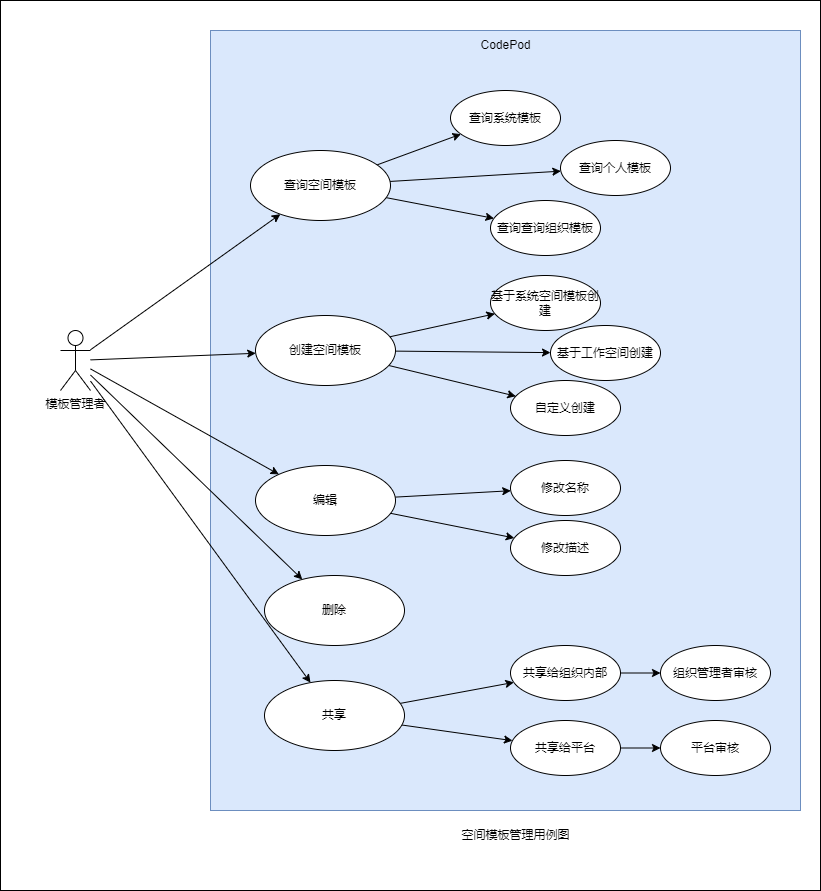
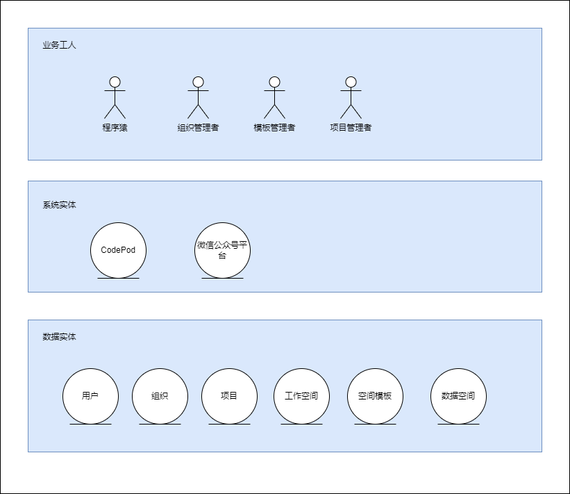

# 业务分析

## 业务愿景

Coding anytime, anywhere! 随时随地编程！

## 关键需求

1. 手上找到一台可以联网的智能设备，打开浏览器（Chrome、Edge），输入 [codepod.space](https://codepod.space)
2. 注册或登录自己的账户
3. 创建一个自己的【工作空间】，选择一个开发环境模板（nodejs、java、dotnet ...），等待系统创建完毕
4. 打开WebIDE，开始编写代码。

## 业务架构

## 业务用例

### 登录注册

### 工作空间用例

### 个人信息管理用例

### 用户组织管理用例

### 项目管理用例

### 空间模板管理用例

### 数据空间管理用例

## 业务实体

