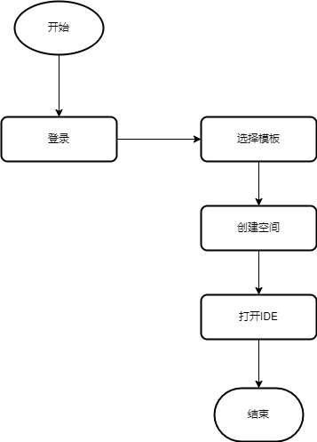
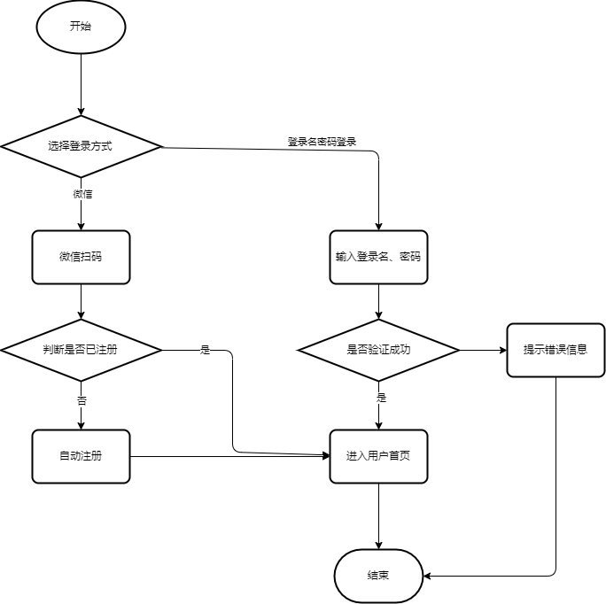
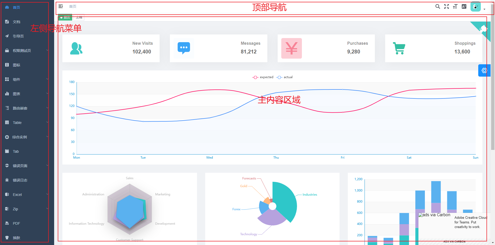
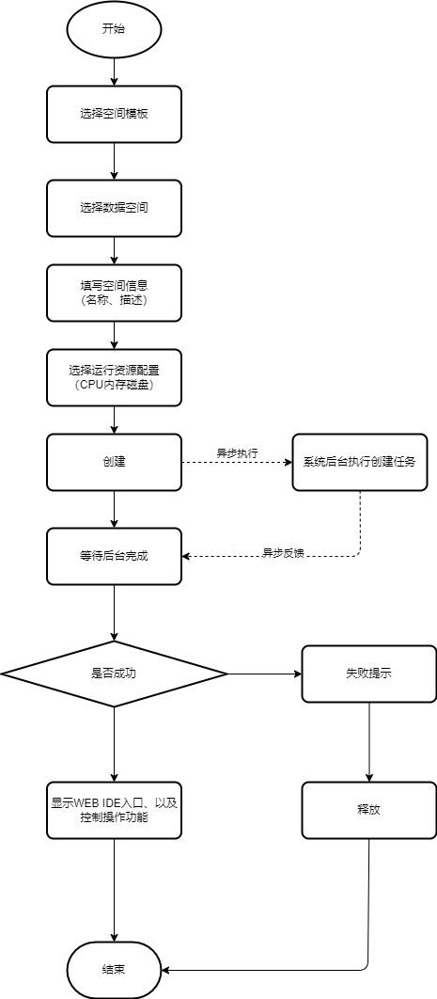

# 需求分析

## 基本流程

## 门户主页

1. logo、业务名称、主图，基本介绍
2. 登录、注册入口
3. 帮助文档、技术文档等跳转链接
4. 其他：底部网站备案信息

## 登录注册

1. 暂不提供注册入口，用户首次通过**微信扫码**，关注微信公众号后自动注册成为本产品用户
2. 扫码位置应提示“扫码默认用户同意《服务条款》、《隐私协议》”
3. 登录成功后，用户可以在**个人信息管理**进行修改登录名、密码，后续可以支持用户名密码登录，为了防止用户手机暂不在身边的情况
4. 登录入口应支持 **微信扫码**、**用户名密码登录**两种方式

登录注册流程：

## 框架布局

1. 应采用前后端分离的技术（非功能）
2. 管理系统的风格，整体采用侧边菜单布局，侧边菜单 + 顶部导航 + 主内容区域
3. 为节省成本可以考虑采用开源的系统框架（非功能）

范例参考：

左侧菜单：

| 菜单名称 | 子菜单 | 功能描述                                           | 其他 |
| -------- | ------ | -------------------------------------------------- | ---- |
| 首页     | 无     | 点击，主内容区域切换，主要展示用户使用的统计信息   |      |
| 工作空间 | 无     | 点击，主内容区域切换，展示用户创建的工作空间列表   |      |
| 空间模板 | 无     | 点击，主内容区域切换，展示用户可使用的空间模板列表 |      |
| 数据空间 | 无     | 点击，主内容区域切换，展示用户创建的数据空间列表   |      |
| ...      |        |                                                    |      |

## 工作空间

### 创建空间流程

### 查询使用

1. 从左侧菜单点击**工作空间**，查询用户已创建的空间列表
2. 支持分页、模糊搜索等查询方式
3. 在列表中看到状态**运行中**状态的空间，点击 **打开 IDE**，打开 WEB IDE，用户将进行在 IDE 中进行编码

### 操作控制

| 操作     | 条件       | 提示         | 状态变化   | 完成状态   | 错误信息             | 备注               |
| -------- | ---------- | ------------ | ---------- | ---------- | -------------------- | ------------------ |
| **释放** | -          | 弹出确认提示 | **处理中** | -          | 鼠标悬浮查看错误提示 | 删除后列表不再显示 |
| **关机** | -          | 弹出确认提示 | **处理中** | **已关机** | 鼠标悬浮查看错误提示 |                    |
| **开机** | **已关机** | -            | **处理中** | **运行中** | 鼠标悬浮查看错误提示 |                    |
| **重启** | **运行中** | 弹出确认提示 | **处理中** | **运行中** | 鼠标悬浮查看错误提示 |                    |

状态图：

## 空间模板

## 数据空间
